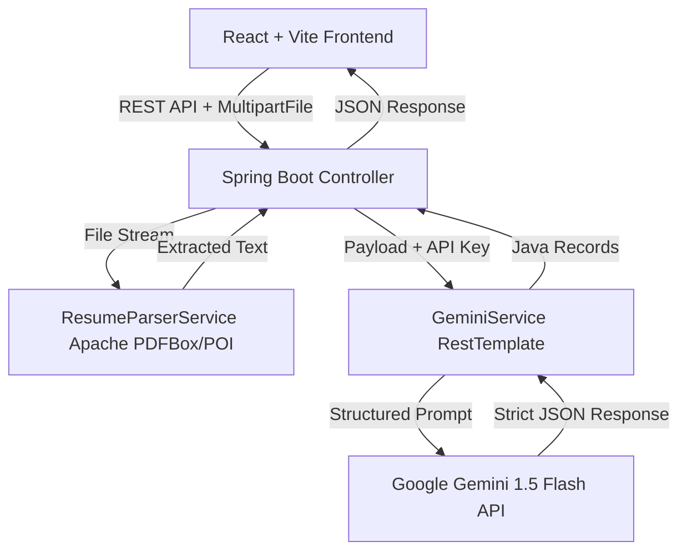

# AI-Powered ATS Resume Analyzer 🚀

A high-performance, premium web application that analyzes, parses, and tailors candidate resumes against job descriptions using **Spring Boot**, **React + Vite**, and **Google Gemini LLM**.

---

## 🏗️ Architecture & Tech Stack



### Backend (Spring Boot)
- **Framework**: Spring Boot 3.3.0 (Java 17/21/25 compatible)
- **Parser Core**: Apache PDFBox 3.0.2 & Apache POI 5.2.5 (Extract text from `.pdf`, `.docx`, and `.txt` files)
- **API integrations**: Google Gemini 1.5 Flash developer endpoints via Spring `RestTemplate` (engineered with structured JSON schemas and strict type matching)
- **Build Tool**: Maven

### Frontend (React)
- **Core Framework**: React 18 + Vite (built for production in under 600ms)
- **Icons**: Lucide React (vector-perfect developer dashboard icons)
- **Styling**: Modern, premium CSS variables using glassmorphism, responsive grid layout, customized radial progress gauges, and custom status loaders
- **Celebration Animations**: Canvas Confetti (triggers on high matching results)

---

## 🌟 Key Features

1. **Intelligent Resume Parsing & Skill Extraction**:
   - Isolates contact details (Name, Email, Phone), work experience timeline, educational records, and soft/hard skills directly from PDFs or Word Documents.
2. **Semantic Job-Description Matching**:
   - Calculates a combined ATS Fit Score based on role requirements, keyword density, and overall structural alignment.
3. **Keyword-Gap Analysis**:
   - Highlights matching skills (green), missing skills required by the job (red), and recommended growth skills (violet).
4. **Actionable Suggestions & SMART Bullet Enhancements**:
   - Generates 3-5 specific suggestions and offers side-by-side, one-click copyable bullet-point rewrites based on action-oriented verb frameworks.
5. **Tailored Cover Letter Generation**:
   - Dynamically crafts a highly personalized cover letter that contextually maps the candidate's achievements to the specific job description requirements.

---

## 📂 Project Structure

```text
├── backend/
│   ├── src/main/java/com/ats/resumeanalyzer/
│   │   ├── config/             # WebMvcConfigurer for CORS control
│   │   ├── controller/         # REST API Routing (analyze, parse, optimize)
│   │   ├── model/              # Java 17 Records mapping Gemini schemas
│   │   ├── service/            # Resume Parser (PDF/DOCX) & Gemini REST Client
│   │   └── ResumeAnalyzerApplication.java
│   ├── src/main/resources/
│   │   └── application.properties # File size configurations and server ports
│   └── pom.xml
│
├── frontend/
│   ├── src/
│   │   ├── App.jsx             # Main dashboard UI logic & state transitions
│   │   ├── index.css           # Premium glassmorphic styling tokens & variables
│   │   └── main.jsx
│   ├── index.html              # HTML structure & SEO meta descriptions
│   ├── package.json
│   └── vite.config.js
```

---

## 🛠️ Setup & Running Instructions

### Prerequisites
- **Java**: JDK 17 or higher (Java 21/25 recommended)
- **Maven**: 3.8+
- **Node.js**: v18+
- **Ollama** (Optional, for offline local analysis): Installed and running with `gemma:2b`

#### Running Local Model via Ollama:
If you want to run the analyzer locally without a cloud Gemini API key:
1. Start Ollama services:
   ```bash
   ollama serve
   ```
2. In another terminal, pull and start the local model:
   ```bash
   ollama run gemma:2b
   ```
3. Type `ollama` in the **Gemini API Key** field in the frontend browser page.

---

### Step 1: Start the Backend (Spring Boot)

1. Open a terminal and navigate to the backend directory:
   ```bash
   cd backend
   ```

2. (Optional) Set your Gemini API key as an environment variable (the backend automatically checks for this key; alternatively, you can enter it directly in the frontend dashboard):
   ```bash
   export GEMINI_API_KEY="your-google-gemini-api-key"
   ```

3. Run the Spring Boot application using Maven:
   ```bash
   mvn spring-boot:run
   ```
   *The backend will boot up and start listening on port `8080`.*

---

### Step 2: Start the Frontend (React + Vite)

1. Open a new terminal and navigate to the frontend directory:
   ```bash
   cd frontend
   ```

2. Run the development server:
   ```bash
   npm run dev
   ```
   *The Vite dev server will start instantly and host the app at `http://localhost:5173`.*

3. Open `http://localhost:5173` in your browser.

---

## 🧠 LLM Prompts & Engineering

The application configures Gemini 1.5 Flash's output behavior by passing generation configurations enforcing `responseMimeType: "application/json"`. Below are the structured prompt definitions executed by `GeminiService.java`:

### 1. ATS Evaluation Prompt
Evaluates the resume against a job description, calculating fit scoring, cataloging skill categories, and outputting formatting feedback:
```text
Evaluate the resume against the job description and output a JSON object strictly matching this schema:
{
  "atsScore": integer (0 to 100),
  "matchPercentage": integer (0 to 100),
  "summary": "String",
  "matchingSkills": ["list"],
  "missingSkills": ["list"],
  "recommendedSkills": ["list"],
  "experienceFeedback": "String",
  "educationFeedback": "String",
  "formatFeedback": "String",
  "actionableSuggestions": ["list"],
  "suggestedBulletPoints": [
    { "original": "String", "optimized": "String", "reason": "String" }
  ]
}
```

### 2. Information Extraction Prompt
Extracts profile structure, education nodes, work experiences, and skills:
```text
Output a JSON object matching this schema:
{
  "candidateName": "String",
  "email": "String",
  "phone": "String",
  "skills": ["list"],
  "experience": [
    { "companyName": "String", "jobTitle": "String", "duration": "String", "description": ["list"] }
  ],
  "education": [
    { "institution": "String", "degree": "String", "graduationYear": "String" }
  ],
  "summary": "String"
}
```

### 3. Optimization and Tailoring Prompt
Renders tailored resume accomplishments side-by-side and creates an alignment-focused cover letter:
```text
Output a JSON object matching this schema:
{
  "overallSuggestions": "String",
  "bulletPointEnhancements": [
    { "original": "String", "optimized": "String", "reason": "String" }
  ],
  "tailoredCoverLetter": "String"
}
```
